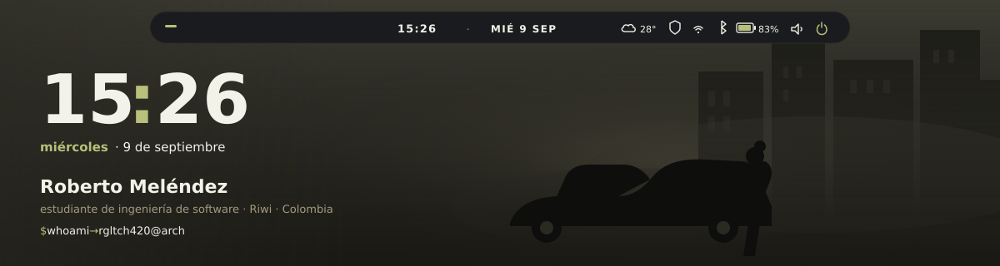

<div align="center">



<br/>

[](https://archlinux.org)
[](https://hypr.land)
[](https://github.com/Alexays/Waybar)
[](https://github.com/rgltch420/SupplySafeAI)
[](https://github.com/rgltch420/cargoops)

<br/>

[](https://github.com/rgltch420)
[](mailto:rmelendez.ruiz@icloud.com)

</div>

<br/>


```
$ whoami
Roberto Meléndez

$ hostnamectl
rgltch420@arch  ·  Colombia  ·  Riwi

$ echo $WM
Hyprland + Waybar
```

Estudiante de **ingeniería de software**. Construyo herramientas para **operaciones logísticas** y **cadenas de suministro**: tracking de embarques, riesgo operativo, **TRM COP/USD** y automatización de procesos.

Backend en **C# / ASP.NET** y **NestJS**. Frontends con roles y accesibilidad. Prototipos de **IA que corren en local** — el dato no sale de la máquina.

<br/>


```
$ pacman -Qs
```

| paquete | para qué |
| --- | --- |
| `dotnet-sdk` | C# / ASP.NET Core |
| `nodejs` + NestJS | APIs, eventos, Redis |
| `typescript` / `javascript` | SPA, Angular, Vite |
| `python` | scripts y automatización |
| `postgresql` + `redis` | datos y cola |
| `docker` | entornos reproducibles |
| `ollama` | modelos locales |

<div align="center">


</div>

<br/>


```
$ ls ~/proyectos
.
├── SupplySafeAI/     C# · resiliencia de cadena de suministro
├── cargoops/         NestJS · tracking de embarques · TRM
├── RecyIA/           Ollama · IA local (ForgeAI)
├── TicketHelper/     SPA · tickets y roles
└── Api_RICK_MORTY/   Vanilla · consumo de API
```

**[SupplySafeAI](https://github.com/rgltch420/SupplySafeAI)** — C# / ASP.NET Core  
Plataforma de resiliencia: detectar, predecir, analizar impacto y actuar. Monitorea envíos, inventario y riesgos; incluye análisis de riesgo y consulta de **TRM USD/COP**.

**[cargoops](https://github.com/rgltch420/cargoops)** — NestJS · PostgreSQL · Redis  
Logintec CargoOps: monolito modular orientado a eventos. Tracking de embarques, integración con navieras y conciliación de ETD/ETA y TRM.

**[RecyIA](https://github.com/rgltch420/RecyIA)** — JavaScript · Ollama  
ForgeAI: analizador de rutinas con modelos locales. Puntúa, sugiere progresión y genera un plan. Nada de eso sale del equipo.

También: [TicketHelper](https://github.com/rgltch420/TicketHelper) · [Api_RICK_MORTY](https://github.com/rgltch420/Api_RICK_MORTY) · [logintec-freight-platform](https://github.com/rgltch420/logintec-freight-platform) · [SPA-ACCESIBLE-](https://github.com/rgltch420/SPA-ACCESIBLE-)

<br/>


```
$ fastfetch
rgltch420@arch
--------------
OS      Arch Linux
WM      Hyprland
Bar     Waybar
Focus   logística · supply chain · TRM
```

<div align="center">
  
  <br/>
  
  
</div>

<br/>


<br/>


```
$ echo $MAIL
rmelendez.ruiz@icloud.com

$ xdg-open https://github.com/rgltch420
```

<div align="center">

[](https://github.com/rgltch420)
[](mailto:rmelendez.ruiz@icloud.com)

<br/>


<br/>


</div>
